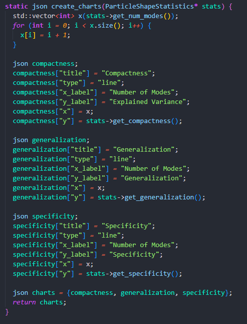

ShapeWorks utilise une méthode appelée Validation Croisée Leave-One-Out (LOOCV) implicite :
Chaque forme est traitée comme si elle était "laissée de côté" du modèle statistique.
Un modèle PCA est construit sur toutes les autres formes.
La forme exclue est reconstruite à l’aide du modèle partiel.
L’erreur de reconstruction est calculée entre la forme réelle et la forme reconstruite.

---

### 1. Métriques d'Erreur

**Erreur de généralisation :**

1) Charger les formes (fichiers .particles).

2) Charger les vecteurs propres et les normaliser.

3) Calculer la forme moyenne parmi toutes les formes.

4) Calculer l’erreur de généralisation pour la forme i-ème :

Pour chaque vecteur propre (composante principale), simuler le leave-one-out en excluant la forme actuelle (la forme i).
Calculer la nouvelle forme moyenne et reconstruire la forme en utilisant les "n_components" premières composantes (considérer delta_shape pour recentrer les formes autour de la forme moyenne).
Calculer les coefficients en projetant delta_shapes dans l’espace des vecteurs propres.

5) Calculer l’erreur de généralisation comme la moyenne des erreurs de généralisation pour toutes les formes.

6) Tracer le graphique.

**Erreur de spécificité :**

1) Charger les formes (fichiers .particles).

2) Charger les vecteurs propres et les normaliser.

3) La fonction "generate_synthetic_shapes" génère un nombre num_samples de formes à partir de la forme moyenne et des vecteurs propres obtenus via la PCA.

Une forme synthétique est générée comme suit :
Ajouter à la forme moyenne (mean_shape) une combinaison linéaire des vecteurs propres sélectionnés.
Le poids de chaque vecteur propre dans la somme est donné par le coefficient correspondant généré aléatoirement (je crois que c’est la bonne méthode).
(Générer une forme à partir de la forme moyenne pour obtenir une forme aléatoire grâce à l’utilisation des vecteurs propres).

4) Calculer l’erreur de spécificité en utilisant la technique Leave-One-Out Cross Validation :

Exclure une forme à chaque itération et générer des formes synthétiques à partir de la forme moyenne des formes restantes.
Pour chaque forme générée, calculer l’erreur comme le minimum de la distance entre la forme synthétique i-ème et les formes réelles.
Obtenir un vecteur d’erreurs (erreur i-ème associée à la forme synthétique i-ème).
Calculer l’erreur associée à l’ensemble des formes (toutes les formes réelles moins une forme réelle j-ème) comme la moyenne de ce vecteur d’erreurs.

5) Répéter cette procédure (LOO) pour chaque forme réelle, puis calculer la moyenne.

---

### 2. Implémentation sur ShapeWorks

**Aller dans le dossier `Program Files\ShapeWorks\Libs\Particles`**

Les métriques d'erreur sont définies dans le fichier `ShapeEvaluation.cpp` sous les fonctions:

- `compute_full_compactness`
- `compute_full_specificity`
- `compute_full_generalization`

Il existe des alternatives nommées:

- `compute_compactness`
- `compute_specificity`
- `compute_generalization`

Leur différence est à étudier...

Ces fonctions sont appellées dans le fichier `ParticleShapeStatistics.cpp` sous les fonctions:

- `get_compactness`
- `get_specificity`
- `get_generalization`

**Aller dans le dossier `Program Files\ShapeWorks\Libs\Analyze`**

Ces fonctions sont appellées dans le fichier `Analyze.cpp`, et le graphique est tracé dans la fonction `create_charts`.

